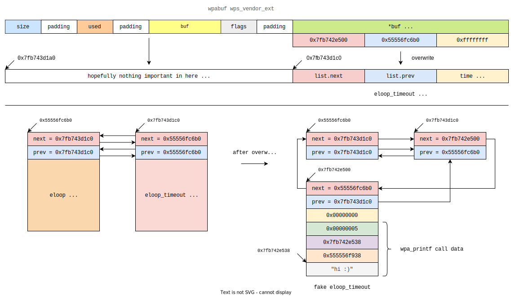

# Skeleton (but pronounced like Peloton)

A Zero-Click RCE exploit for CVE-2021-0326 on the Peloton Bike 

And also every other unpatched Android Device 

PoC requires ASLR to be disabled.

Associated blog post: https://www.nowsecure.com/blog/2022/02/09/a-zero-click-rce-exploit-for-the-peloton-bike-and-also-every-other-unpatched-android-device/

